

    
    <h2>ours group plan's</h2>
    
함께 여행하기 위한 그룹 커뮤니티 플랫폼

    

# 🙋🏻‍♂️ 팀원 소개

|  이름  |                    Github                     |
| :----: | :-------------------------------------------: |
| 정호빈 |  [jeonghobin](https://github.com/jeonghobin)  |
| 함소명 | [Hamsomyeong](https://github.com/Hamsomyeong) |

# 🛠 기술 스택

**Backend `Java` `SpringBoot` `myBatis` `SpringRestDocs` `Maven` `JWT`**

**Frontend `Npm` `Node` `Javascript` `Vue.js` `BootStrap`**

**Database `MySql`**

**Version Control `GitLab`**

---

## :pushpin: 프로젝트 소개

**서비스 설명**

### **개요**

한줄 소개 : 함께 여행하기 위한 그룹 커뮤니티 플랫폼

서비스 명 : **O!GPS(ours group plan's)**

### **타겟 🎯**

혼자 계획 짜는 것을 힘들어하는 사람들
같이 여행 할 동료를 찾는 사람들
그룹으로 여행 계획을 세우고 커뮤니티를 즐기고 싶은 사람들

## **기획 배경**

함께 여행을 가고 싶을 때, 일반적으로 한 사람이 여행 계획을 짜거나 여러 여행지를 올려 고르면서 여행 계획을 짜고 있습니다. 소통하며 순서별 여행 계획을 짜고, 함께 여행 갈 친구가 없을 때에는 같은 목적지를 여행하고 싶은 그룹과 함께 여행을 떠날 수도 있는 플랫폼을 개발 하고자 하였습니다.

# 🖥 기능 소개

| 번호 | 기능                     | 설명                                                                         |
| :--: | ------------------------ | ---------------------------------------------------------------------------- |
|  1   | 로그인 및 알림           | JWT를 활용한 로그인 관리 및 그룹 참여 수락/거절 알림 기능                    |
|  2   | 관광지 페이지            | 전국 관광지 검색, 위치 확인 할 수 있습니다.                                  |
|  3   | 전체 게시판              | 같이 여행 할 사람 모집, 모든 사람의 여행 그룹을 확인 할 수 있습니다.         |
|  4   | 내 게시판                | 내가 속한 여행 그룹을 확인 할 수 있습니다.                                   |
|  5   | 그룹원 및 여행계획 관리  | 그룹 참여 승인 요청, 그룹 탈퇴, 여행 계획 관리, 소통 할 수 있는 공간 입니다. |
|  6   | 여행 계획 생성           | 관광지를 선택 하고, 목적지와 함께 메모를 작성할 수 있습니다.                 |
|  7   | 여행 계획 확인           | 계획을 확인, 좋아요, 수정, 삭제 할 수 있습니다.                              |
|  8   | 여행 후기 및 좋아요 순위 | 조회수, 좋아요 여행 후기를 확인 할 수 있습니다.                              |
|  9   | 여행 후기 작성           | 다중 이미지 업로드, 여행 후기를 작성 할 수 있습니다.                         |
|  10  | 여행 후기 확인           | 후기 확인, 좋아요, 댓글, 수정, 삭제 할 수 있습니다.                          |
|  11  | 날씨                     | OpenWeatherMap API를 활용해 주요 도시의 주간 날씨를 제공합니다.              |

### 로그인 및 알림

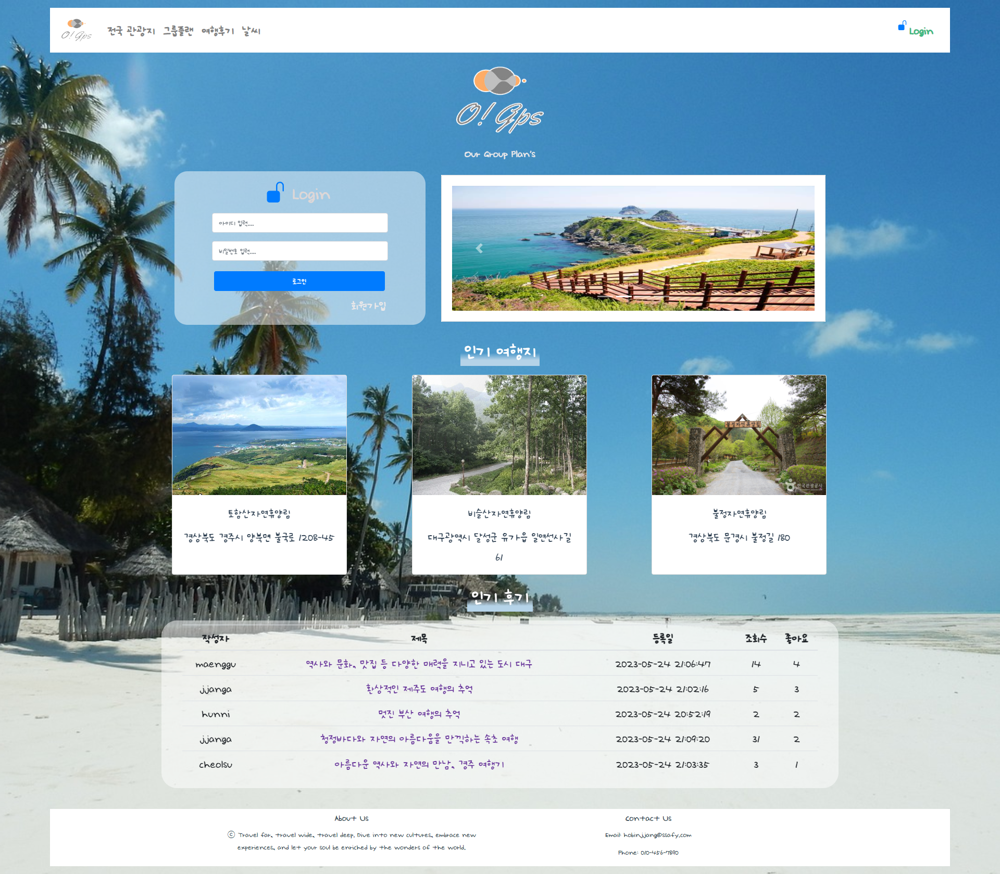
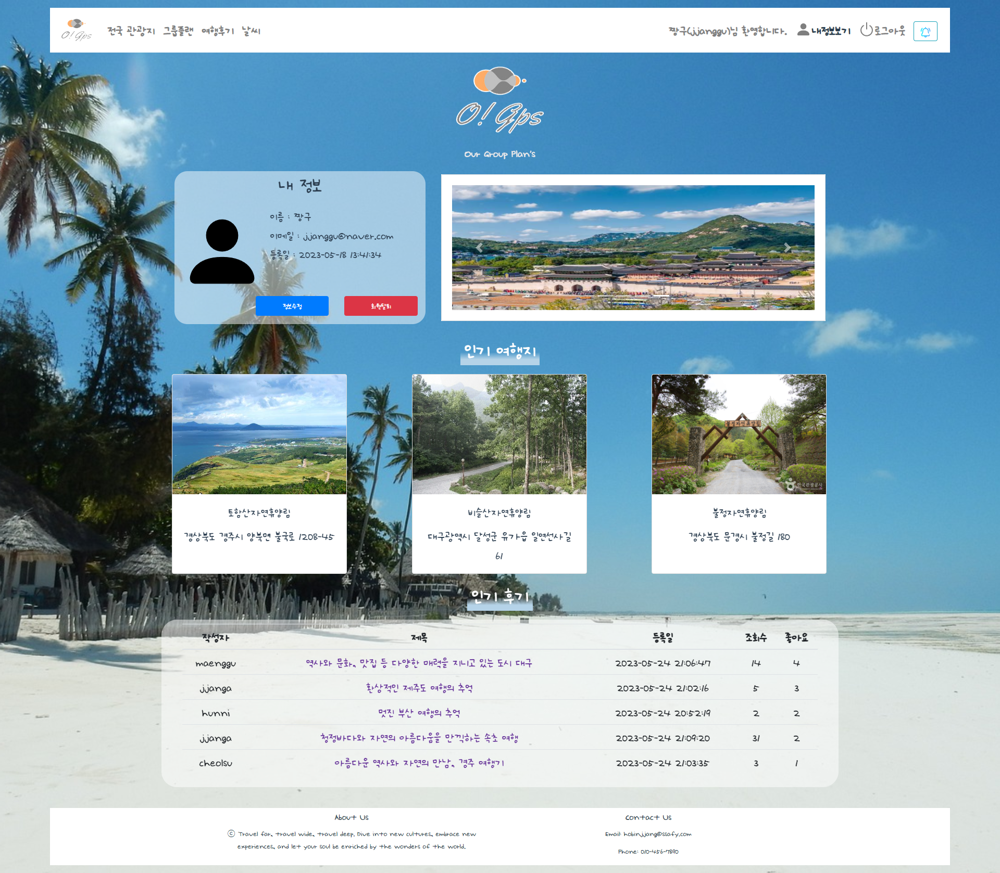
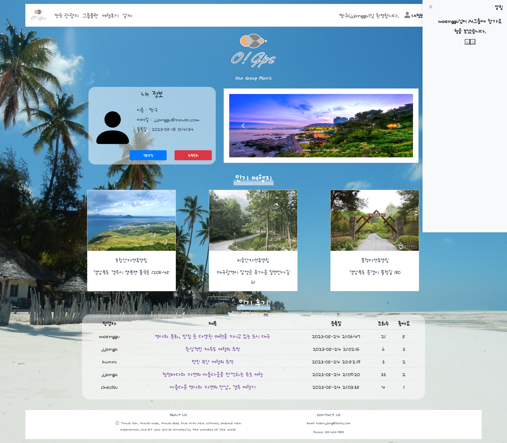

### 관광지 검색

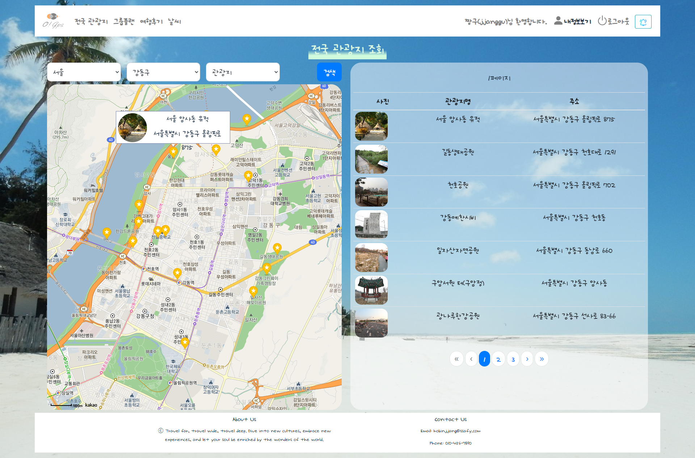

### 그룹 관리

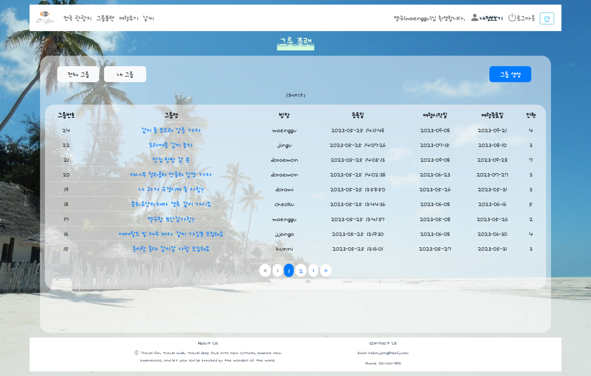
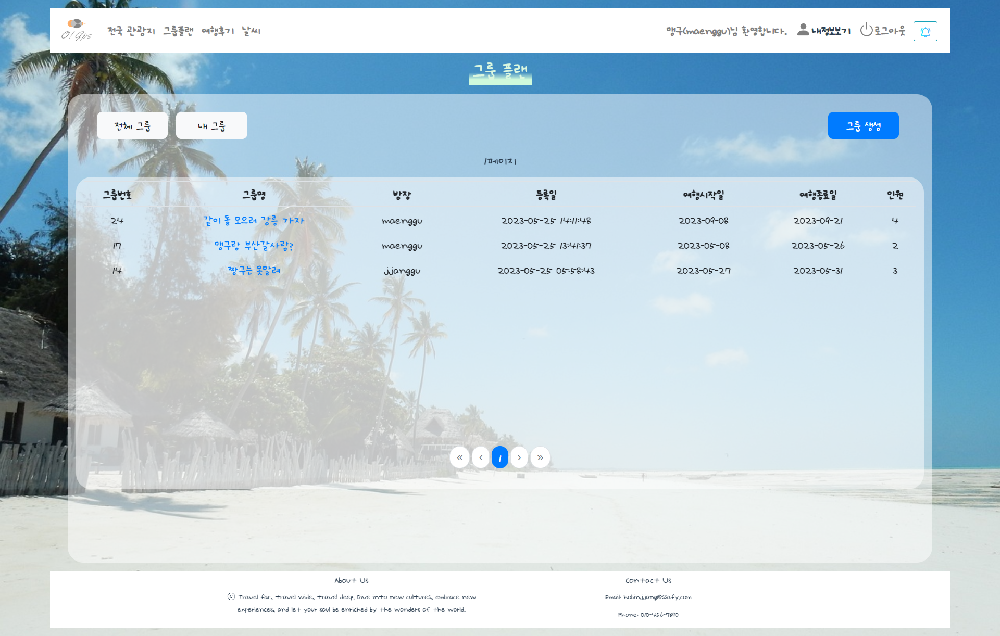

### 여행 계획 관리

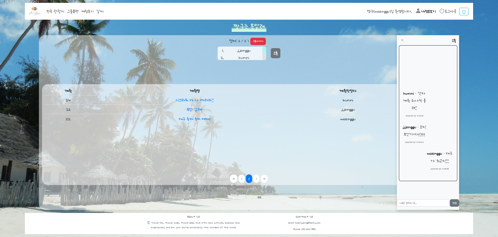
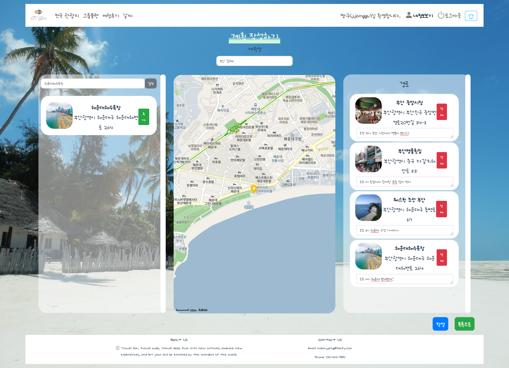
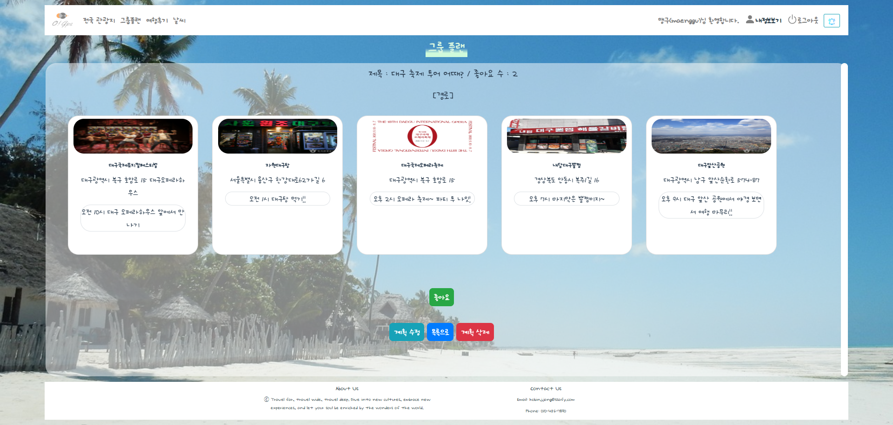

### 여행 리뷰

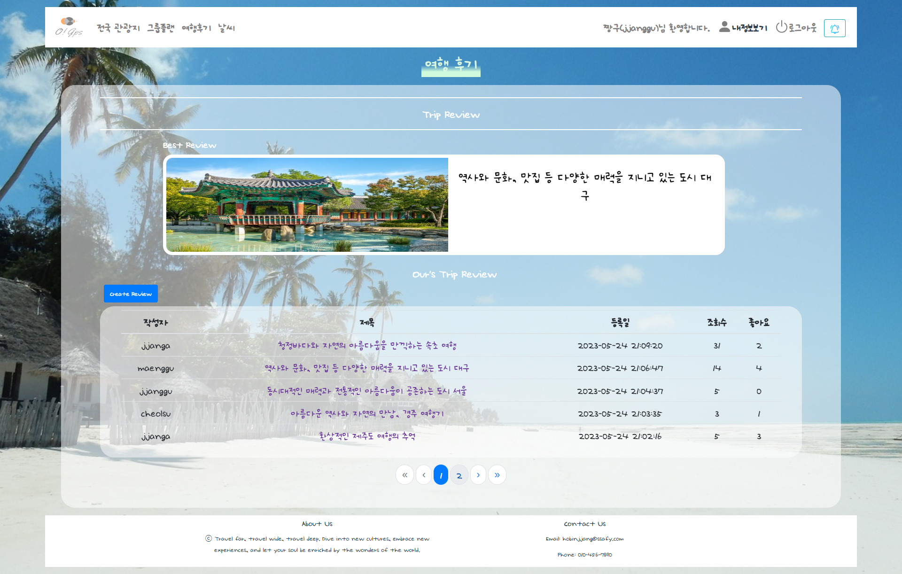
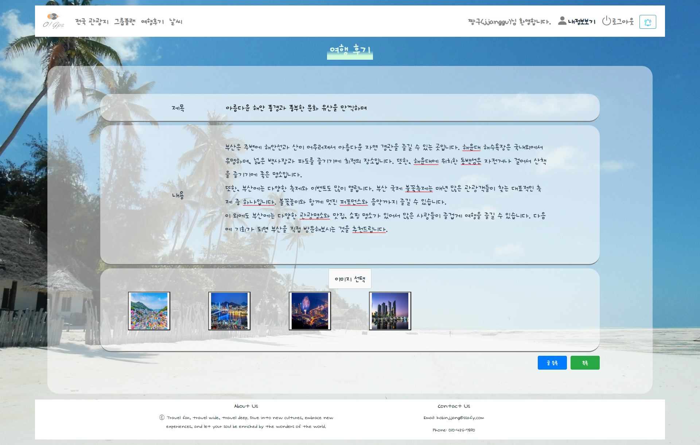
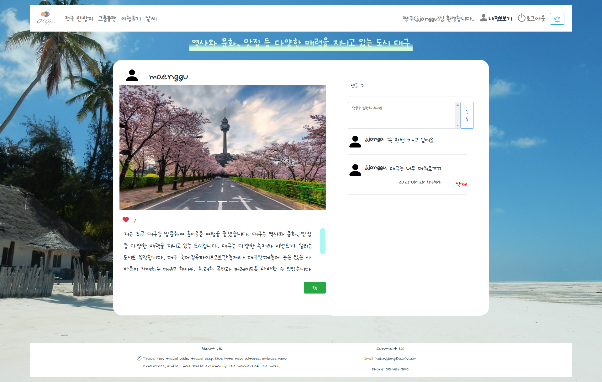

### 날씨

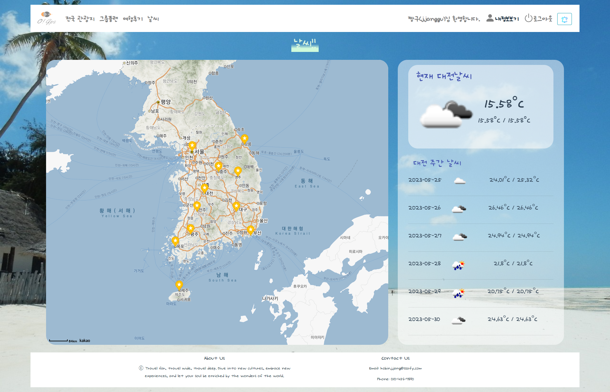
